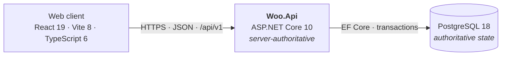

# Architecture — Weapons of Chaos and Order

**Status:** Accepted (Prompt 2)
**Date:** 3 August 2026
**Product source:** [`../Weapons_of_Chaos_and_Order_Game_Workbase.md`](../Weapons_of_Chaos_and_Order_Game_Workbase.md)
**Execution contract:** [`../Weapons_of_Chaos_and_Order_Agent_AI_Implementation_Prompts.md`](../Weapons_of_Chaos_and_Order_Agent_AI_Implementation_Prompts.md)

This document describes **what exists and what is deliberately deferred**.
Individual decisions live in [`../adr/`](../adr/). Prompt-by-prompt deliverables
live in [`SLICES.md`](SLICES.md).

> **This replaced a much larger Prompt 1 document.** That version specified a
> separate worker, a transactional outbox, a durable job engine, object storage,
> six database schemas, an Azure topology and a two-compiler TypeScript setup —
> none of which the first playable slice needs. See
> [ADR-0011](../adr/0011-minimal-platform-shape.md) for why it was cut back.

---

## 1. Shape

One process. One database. One web client.



**Server authority.** The client renders what the server sends and submits
commands. It never computes an outcome, elapses time, or decides ownership.
Every rule that matters lives behind the API.

That is the whole runtime picture. There is no worker, no queue, no cache, no
object store and no cloud resource.

---

## 2. Selected versions

Verified against the package registries on 3 August 2026.

| Component | Version | Basis |
|---|---|---|
| .NET SDK | **10.0.200**, pinned in `global.json` | Current LTS. Installed locally |
| ASP.NET Core / runtime | 10.0 | LTS |
| EF Core | 10.0.10 | Latest stable 10.x |
| Npgsql.EntityFrameworkCore.PostgreSQL | 10.0.3 | Matches EF Core 10 |
| PostgreSQL | 18 (`postgres:18-alpine`) | Docker Compose only |
| xunit.v3 | 3.2.2 | With `xunit.runner.visualstudio` 3.1.5 for `dotnet test` discovery |
| Node.js | **22** (`.nvmrc`) | Satisfies Vite 8's `>=22.12`; matches the installed 22.18.0 |
| React | 19.2.8 | |
| Vite | 8.2.0 | With `@vitejs/plugin-react` 6.0.5 |
| **TypeScript** | **6.0.3 — one install, no alias** | See below |
| ESLint | 10.8.0 | With `typescript-eslint` 8.65.0 |

### 2.1 One TypeScript compiler

`typescript@latest` is 7.0.2, but `typescript-eslint@8.65.0` declares a peer
range of `typescript: >=4.8.4 <6.1.0` — TypeScript 7 ships without the
programmatic API that type-aware linting needs.

**`typescript@6.0.3` is published under the plain package name** and provides
the `tsc` binary. So the project installs exactly that: one compiler, driving
both `npm run typecheck` and `npm run lint`, with no alias entries and no second
binary. Vite never type-checks — it transpiles — so it is unaffected.

Revisit when TypeScript 7.1 ships **and** `typescript-eslint` supports it.
Recorded in [ADR-0012](../adr/0012-frontend-stack.md).

---

## 3. Repository layout

```
woo-runeforging/
├─ global.json                 # SDK 10.0.200
├─ Directory.Build.props       # net10.0, nullable, warnings as errors
├─ Directory.Packages.props    # central package management
├─ Woo.slnx
├─ .nvmrc  .editorconfig  .gitignore  .gitattributes
│
├─ docs/                       # planning documents, architecture, ADRs, status
│
├─ src/Woo.Api/
│  ├─ Program.cs               # composition root
│  ├─ Persistence/             # WooDbContext
│  └─ Features/                # one folder per feature
│     ├─ Health/
│     └─ Platform/
│
├─ tests/Woo.Tests/            # the one test project
│
├─ web/
│  └─ src/{main.tsx, App.tsx, api/, styles.css}
│
├─ docker/
│  ├─ docker-compose.yml      # PostgreSQL only
│  └─ .env.example            # Compose variables — the backend does not read these
├─ scripts/                    # documentation checks
└─ .github/workflows/validate.yml
```

Two .NET projects. One npm package. Nothing is added until a prompt makes it
playable.

---

## 4. Feature folders

The application is a **modular monolith organised by feature folder**, not by
technical layer. A feature owns its endpoints, its handlers and its persistence
configuration in one directory, so a change to construction touches
`Features/Construction/` and little else.

**Exists today:** `Health`, `Platform`. Both are platform plumbing with no
gameplay meaning.

**Reserved for the first playable slice** (Foundations of Iron):

> Houses · Settlements · Resources · Forge · Armies · Battles

These names are **documented, not created**. Workbase §19 is explicit that
future systems "do not need projects, tables, services, or empty abstractions
before use", so each folder appears in the change set that first makes it do
something — Prompt 3 onward.

Later areas — Contracts, Markets, Situations, Runes, Orders, Warfronts, History
— follow the same rule.

### 4.1 Where deterministic simulation will live

Battle resolution and, much later, Runeforging risk are **pure calculations**:
same inputs plus the same rules/content version plus the same seed must produce
the same result, on any machine, forever, because a stored replay has to stay
replayable.

When that code arrives (Prompt 14), it goes in its own folder or project with
**no dependency on HTTP, EF Core, the file system, the wall clock or ambient
randomness** — the constraint being that it takes everything it needs as an
explicit argument. Nothing is built for it now.

---

## 5. PostgreSQL, EF Core, migrations and transactions

**One `WooDbContext`.** One model, one connection, one transaction scope, one
migration history, the default `public` schema. Splitting into several contexts
or a schema per feature would buy nothing at this size and would make an
ordinary cross-feature command — spend resources *and* start construction *and*
write the ledger entry — awkward to keep in a single transaction.

Today the context declares **no entity types**. Prompt 2 proves connectivity;
the first entities and the first migration arrive with the Foundations of Iron
domain model in Prompt 3.

**Migrations.** EF Core migrations against the single context, created with
`dotnet ef migrations add` and reviewed like code. Applying them is an explicit
step, not something the API does on startup in a real environment.

**Transactions.** `SaveChangesAsync` is already one transaction. A command that
must change several things together opens one explicitly with
`Database.BeginTransactionAsync`, and everything commits or nothing does. This
is the mechanism behind the product rule that gold and goods movements are
transactional and ledgered.

### 5.1 Elapsed-time progression

Construction, crafting, training, travel and passive production all take game
time. They are represented as **stored timestamps**, not as timers:

- a row records when the work started and when it completes;
- progress is computed from those timestamps whenever the state is read;
- any write settles the elapsed effect first, then applies the change.

**There is no per-House timer, no scheduled task and no background job.** A
player who is away for three days has their progress resolved on the next read,
in one query, and the server's workload tracks player decisions rather than
player count multiplied by wall-clock time. This is what makes the deferral of
background-job infrastructure ([§8](#8-deferred)) sustainable rather than
merely postponed.

---

## 6. API and logging

- REST under `/api/v1/…`, JSON. Versioned by URL segment so a breaking change
  is a new segment rather than a silent contract change.
- `GET /health` — one endpoint, backed by
  `AddDbContextCheck<WooDbContext>()`. It answers whether the process is
  serving and can reach PostgreSQL. 200 when healthy, 503 when not.
- `GET /api/v1/platform/status` — the one endpoint the web client calls.
  Returns the application name, environment, server UTC time and whether the
  database is reachable. It carries **no gameplay meaning** and deliberately
  does **not** expose the PostgreSQL server version.
- **Structured logs to stdout** through the built-in JSON console logger. One
  JSON object per entry, UTC timestamps. No logging package, no telemetry
  exporter, no collector.

**Configuration.** Layered `appsettings.json` → `appsettings.{Environment}.json`
→ environment variables (`ConnectionStrings__Woo`). The application **refuses to
start** with a clear message if the connection string is missing, rather than
failing on the first request. `appsettings.Development.json` carries local
Compose credentials only; nothing secret is committed, and `.gitignore` excludes
`.env`, `appsettings.*.local.json`, `secrets.json` and key material.

`docker/.env` is a **Compose** file, not an application one. The .NET
configuration system already layers environment variables, so no dotenv package
exists and none is wanted. Changing the container's port or password therefore
requires setting `ConnectionStrings__Woo` for the API as a separate step —
documented in [`../../README.md`](../../README.md#configuration).

---

## 7. Local development and CI

Compose runs **PostgreSQL and nothing else**. The API and the web client run on
the host, which keeps hot reload and breakpoints working.

The container publishes host port **5433**, not 5432. A machine with a native
PostgreSQL service installed already owns 5432, and that listener silently wins
over the Docker mapping — which produces an authentication failure against the
wrong server. 5433 makes the project independent of what else is installed.
Override with `POSTGRES_PORT`.

Exact commands are in [`../../README.md`](../../README.md).

**CI** (`.github/workflows/validate.yml`) runs the same commands a developer
runs, in three jobs:

| Job | Runs |
|---|---|
| `backend` | `dotnet format --verify-no-changes`, `build -c Release`, `test` — against a `postgres:18-alpine` **service container**, so database connectivity is machine-proven rather than asserted |
| `frontend` | `npm ci`, `lint`, `typecheck`, `build` |
| `docs` | `check-adrs.sh`, `check-doc-links.sh` |

No deployment workflow and no image publishing exist.

---

## 8. Deferred

Nothing here is rejected — each is deferred until something concrete justifies
it. Adding any of them earlier is how a two-person project acquires a platform
team's maintenance burden.

| Deferred | Reintroduce when |
|---|---|
| **Authentication and accounts** | Prompt 25, the first multi-player test |
| **Separate worker process** | In-process work measurably cannot be done safely at request time |
| **Background-job infrastructure** (due jobs, leases, retries) | An action genuinely cannot be resolved from timestamps on read ([§5.1](#51-elapsed-time-progression)) |
| **Transactional outbox** | A post-commit reaction must survive a crash and cannot be recomputed |
| **Idempotency keys on commands** | Prompt 9, and only for commands a client may realistically submit twice |
| **Object storage / Azurite** | The art library outgrows shipping with the application |
| **Asset manifest** | Same trigger as object storage |
| **PixiJS** | Prompt 7, the first battle replay |
| **Redis or a message broker** | Measured throughput PostgreSQL cannot serve |
| **Multiple `DbContext`s or per-feature schemas** | Measured contention or a real ownership dispute |
| **OpenTelemetry** | Operating a real shared environment (Prompt 28) |
| **Architecture-test frameworks** | Enough modules exist that direction cannot be reviewed by eye |
| **Azure, Bicep, deployment, image publishing** | A local playable slice exists and the owner authorises deployment (Prompts 28–29) |
| **Kubernetes, microservices** | Not foreseen at this scale |
| **Markets, multiplayer, Runeforging gameplay** | Their own numbered prompts, after their gates pass |

The owner has Azure for Students, but **local development requires no Azure and
no paid service**, and that stays true.

---

## 9. Product invariants to honour

These come from the Workbase and constrain the code that arrives in later
prompts. **None of them is implemented yet** — they are recorded here so the
first implementation of each does not have to rediscover them.

1. The server is authoritative for time, resources, construction, forge
   outcomes, battle outcomes, rewards and world state.
2. Every gold and goods movement is transactional and ledgered.
3. A weapon or batch has **one** exclusive state, destination and owner at a
   time.
4. One confirmed Runeforging attempt has **one immutable outcome**. A retry
   never produces another roll.
5. A destructible rune cannot be destroyed twice; a singular rune cannot be
   destroyed by an ordinary failure at all.
6. Battle simulation is deterministic from explicit inputs, rules version and
   seed. The replay renders the event log and calculates nothing.
7. Ordinary forging has a guaranteed quality floor and no hidden roll.
   Destructive chance belongs to Runeforging alone.
8. Permanent House progression and seasonal state stay separable; a season can
   never delete a settlement.

Domain vocabulary is in [`../domain/GLOSSARY.md`](../domain/GLOSSARY.md).
