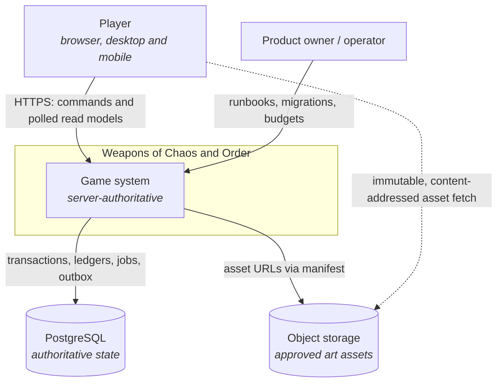
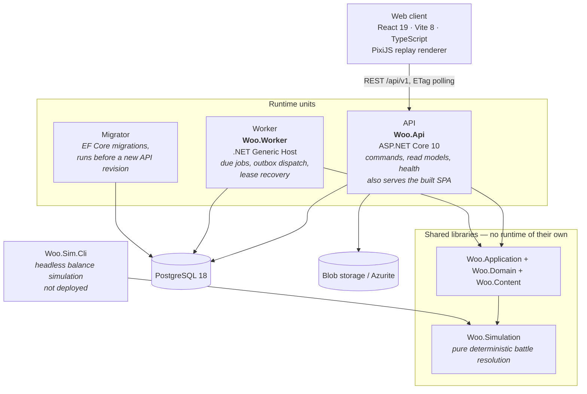
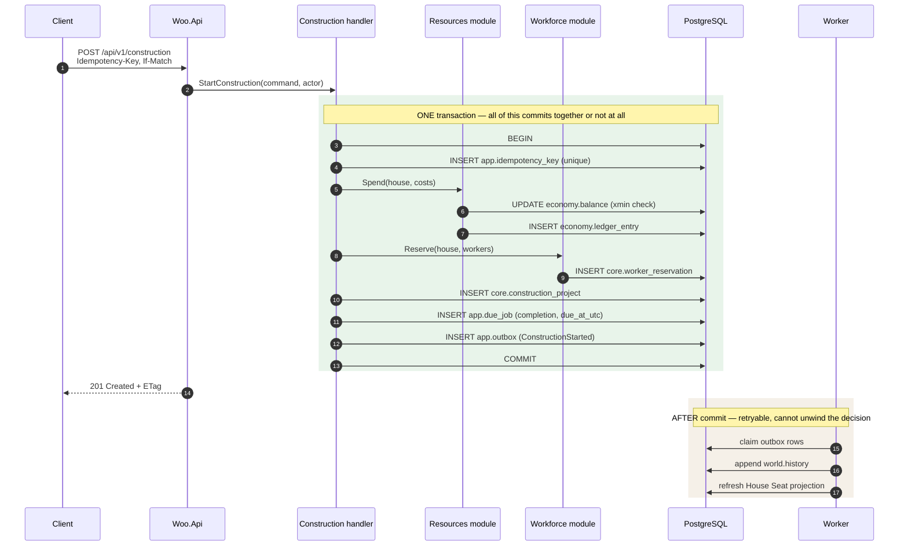
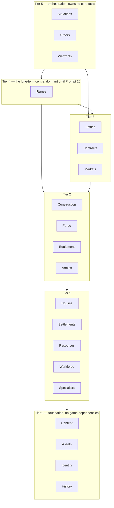
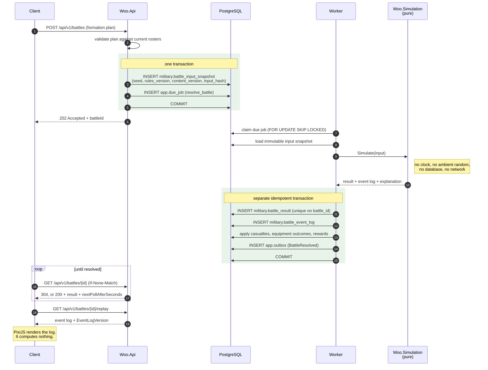
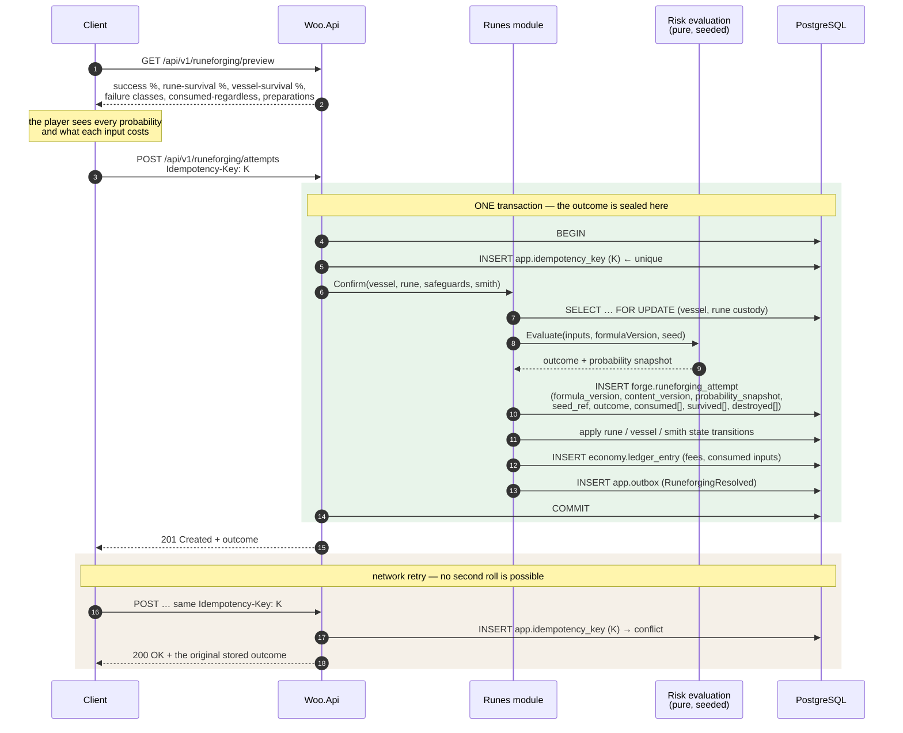
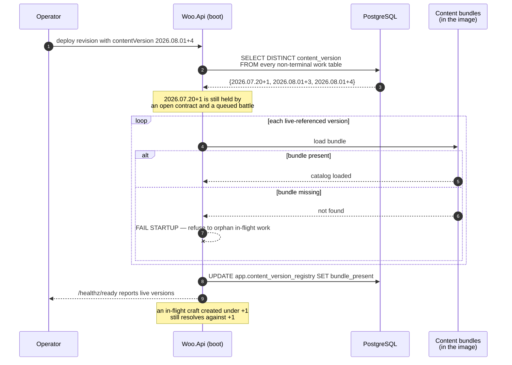
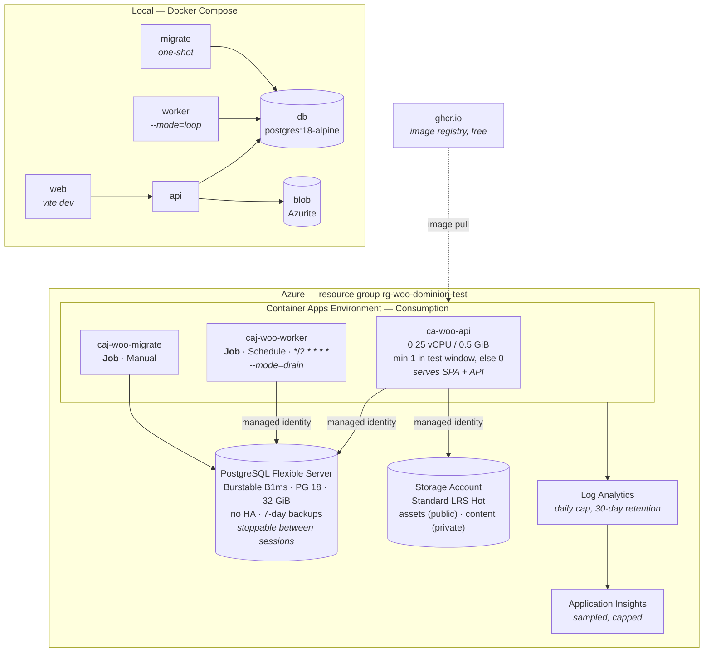

# Architecture — Weapons of Chaos and Order

**Status:** Accepted (Prompt 1 gate)
**Date:** 1 August 2026
**Product source:** `Weapons_of_Chaos_and_Order_Game_Workbase.md`
**Execution contract:** `Weapons_of_Chaos_and_Order_Agent_AI_Implementation_Prompts.md`

This document is the technical source of truth. Individual decisions and their
alternatives live in [`../adr/`](../adr/). The mapping from each numbered prompt
to the modules and contracts it lands in lives in [`SLICES.md`](SLICES.md).

---

## Contents

| § | Section |
|---|---|
| 1 | [Purpose, scope and shape](#1-purpose-scope-and-shape) |
| 2 | [Selected versions](#2-selected-versions) |
| 3 | [Runtime units](#3-runtime-units) |
| 4 | [Solution layout, modules and dependency direction](#4-solution-layout-modules-and-dependency-direction) |
| 5 | [Determinism: clocks, randomness, battle and replay](#5-determinism-clocks-randomness-battle-and-replay) |
| 6 | [PostgreSQL: boundaries, conventions, migrations, concurrency](#6-postgresql-boundaries-conventions-migrations-concurrency) |
| 7 | [Durable jobs, idempotency and the outbox](#7-durable-jobs-idempotency-and-the-outbox) |
| 8 | [Authored content](#8-authored-content) |
| 9 | [Assets and object storage](#9-assets-and-object-storage) |
| 10 | [Authentication and authorization boundary](#10-authentication-and-authorization-boundary) |
| 11 | [API style and polling](#11-api-style-and-polling) |
| 12 | [Local development](#12-local-development) |
| 13 | [Azure deployment topology](#13-azure-deployment-topology) |
| 14 | [Configuration and observability](#14-configuration-and-observability) |
| 15 | [Critical invariants register](#15-critical-invariants-register) |
| 16 | [Repository layout](#16-repository-layout) |

---

## 1. Purpose, scope and shape

### 1.1 What is being built

A **server-authoritative, persistent, asynchronous multiplayer strategy RPG**.
A player leads one minor House, grows one settlement from outpost to regional
capital, forges ordinary equipment, arms companies, fights deterministic
battalion battles, trades — and eventually discovers runes, risks them in the
forge, and pursues Artifacts.

The architecture must serve the **whole** journey without building it all at
once. Two product gates control the order:

| Slice | Proves | Prompts |
|---|---|---|
| **Foundations of Iron** | The grounded medieval loop is understandable and satisfying | 5–18 |
| **First Flame** | Runeforging is tense, fair and strong enough to define the game | 19–24 |

Multiplayer follows only after both pass.

### 1.2 The five properties everything else serves

1. **Server authority.** The client renders projections and submits commands.
   It never computes an outcome, elapses time, or decides ownership.
2. **Determinism.** Any simulated outcome is reproducible from explicit inputs,
   a rules/content version and a seed. Nothing reads a wall clock or ambient
   randomness inside the simulation.
3. **Transactional integrity.** Gold, goods, equipment, soldiers and runes move
   inside transactions with a ledger entry. Retries and duplicate delivery
   cannot create value.
4. **One outcome per confirmation.** A confirmed command produces exactly one
   effect, whatever the network does. This is infrastructure, and it is proven
   on ordinary construction and crafting long before a rune is at stake.
5. **Medieval-first, structurally.** The rune model exists in schemas and
   aggregates from the beginning; rune gameplay is unreachable, and the module
   graph makes leakage a compile error rather than a review comment.

### 1.3 Deliberate non-goals for the closed test

No microservices. No Kubernetes. No message broker. No Redis. No real-time
combat. No blockchain. No runtime AI-generated content. No monetization. No
paid cloud dependency for local development.

Each has a named revisit threshold in [§7.4](#74-what-is-deliberately-not-used).

---

## 2. Selected versions

Verified against official sources in August 2026. Every entry states its support
horizon so the next review has a date rather than a guess.

| Component | Version | Basis |
|---|---|---|
| **.NET SDK** | **10.0.200**, pinned exactly | Current LTS, supported to **14 Nov 2028**. Installed locally. |
| **.NET runtime / ASP.NET Core** | **10.0** | LTS. .NET 11 is preview only. |
| **C#** | **14** | .NET 10 default. |
| **EF Core** | **10.0** (LTS) | Requires .NET 10 SDK and runtime. Supported to Nov 2028. |
| **Npgsql / Npgsql.EntityFrameworkCore.PostgreSQL** | **10.0.x** | Matches EF Core 10. |
| **PostgreSQL** | **18** (18.4) | Latest stable, EOL Nov 2030. Azure Flexible Server supports 18 and creates new servers at 18.4. |
| **Node.js** | **24 LTS ("Krypton")** | Active LTS. Pinned via `.nvmrc` and `engines`. |
| **npm** | **11.x** | Bundled with Node 24. Single package manager. |
| **React** | **19.2.x** | Latest stable. No React 20 announced. |
| **TypeScript** | **7.0.2 and 6.0.2, side by side** | See [§2.1](#21-typescript-two-compilers-on-purpose). |
| **Vite** | **8.x** | Stable since Mar 2026, Rolldown default. Requires Node ≥ 20.19 / ≥ 22.12. |
| **@vitejs/plugin-react** | **6.x** | Oxc-based React Refresh. |
| **PixiJS** | **8.x** | Current v8 line. **Not added until Prompt 7.** |
| **Docker Compose** | **v2.40+** | Installed. |

`global.json`:

```json
{
  "sdk": {
    "version": "10.0.200",
    "rollForward": "latestPatch",
    "allowPrerelease": false
  }
}
```

An exact feature-band pin. `latestPatch` accepts security patches inside
10.0.2xx and nothing else. CI resolves the SDK from this file, so the runner and
a developer machine compile with the same toolchain.

> **Library note:** FluentAssertions v8 and later are commercially licensed.
> Use built-in xUnit assertions plus **Shouldly**. Do not add FluentAssertions.

### 2.1 TypeScript: two compilers, on purpose

TypeScript 7.0 shipped in July 2026 as a Go-native compiler that type-checks
roughly 8–12× faster. It ships **without a programmatic API**; that arrives in
7.1. `typescript-eslint` — like `ts-jest` and `ts-morph` — imports the classic
compiler API from the bare specifier `typescript` and calls `getTypeChecker()`.

Because those tools resolve `typescript` **by name through peer dependencies**,
the package installed under that name has to be the one that still has an API.
So the fast compiler goes under an alias and the compatible one keeps the plain
name:

```jsonc
// web/package.json
{
  "devDependencies": {
    "@typescript/native": "npm:typescript@^7.0.2",
    "typescript": "npm:@typescript/typescript6@^6.0.2",
    "typescript-eslint": "^8.x"
  }
}
```

> **`@typescript/native` is not a published package.** It returns 404 on the npm
> registry, and that is correct. In `npm:` alias syntax the **left** side is an
> arbitrary local name and the **right** side is what is actually installed. So
> `"@typescript/native": "npm:typescript@^7.0.2"` installs the real
> `typescript` package at version 7 under the local folder name
> `@typescript/native`. Do not "fix" this by looking the name up on npm.

The two packages declare different executables, so nothing collides
(verified against the registry):

| Installed under | Real package | Declares `bin` |
|---|---|---|
| `@typescript/native` | `typescript@7.0.2` | `tsc` |
| `typescript` | `@typescript/typescript6@6.0.2` | `tsc6` |

That yields exactly the mapping we want: `npx tsc` runs TypeScript 7, `npx tsc6`
runs TypeScript 6, and anything resolving the bare module specifier
`typescript` — `typescript-eslint`, `ts-morph`, `ts-jest` — gets the TypeScript 6
API that still exists.

| Script | Command | Compiler | Purpose |
|---|---|---|---|
| `npm run typecheck` | `tsc --noEmit` | TypeScript 7.0.2 | Authoritative type check, local and CI — the fast one |
| `npm run lint` | `eslint .` | TypeScript 6.0.2 *(via module resolution)* | `typescript-eslint` type-aware rules |
| `npm run build` | `vite build` | Vite 8 / Oxc | Transpile only. **Never type-checks.** |

TypeScript 7.0 is designed to type-check identically to 6.0 with
`stableTypeOrdering` enabled and no `ignoreDeprecations`, so the two agree on
what constitutes an error.

**Collapse trigger:** when TypeScript 7.1 ships *and* `typescript-eslint`
releases support for it, delete the alias pair and depend on `typescript@7`
alone. Recorded in [ADR-0002](../adr/0002-frontend-stack.md).

---

## 3. Runtime units

### 3.1 Context



The player's browser reads assets directly from object storage but **never**
reads or writes game state except through the API.

### 3.2 Containers



### 3.3 Responsibilities

| Unit | Project | Responsibility | Local | Azure |
|---|---|---|---|---|
| **Web client** | `web/` | Renders read models, submits commands, plays battle replays from the stored event log. **Never computes an outcome.** | Vite dev server | Built to static files, **served by the API container** |
| **API** | `src/Woo.Api` | HTTP boundary: validation, authorization, read models, ETag concurrency, polling, health. Writes durable jobs; does not run long work. | Container or IDE | Container App `ca-woo-api` |
| **Worker** | `src/Woo.Worker` | Claims due jobs under lease, executes completions, dispatches the outbox, reclaims expired leases. **Same Application and Infrastructure assemblies as the API.** | Long-running (`--mode=loop`) | Container Apps **Job** `caj-woo-worker` (`--mode=drain`) |
| **Migrator** | `Woo.Infrastructure` entrypoint | Applies EF Core migrations. **Never auto-runs on API start in production.** | Compose one-shot | Container Apps Job `caj-woo-migrate` |
| **Simulation** | `src/Woo.Simulation` | **A library, not a runtime unit.** Pure deterministic resolution, loaded by API (preview), Worker (authoritative) and CLI. | — | — |
| **Balance CLI** | `tools/Woo.Sim.Cli` | Headless mass simulation for Prompt 4 (economy) and Prompt 20 (Runeforging risk funnel). Reproducible manifest plus machine-readable results. | `dotnet run` | Not deployed |
| **PostgreSQL** | — | Sole authoritative store: state, ledgers, jobs, outbox, content registry, history. | `postgres:18-alpine` | Flexible Server B1ms |
| **Object storage** | — | Approved art and content bundles behind `IObjectStore`. | **Azurite** — same SDK, zero drift | Azure Blob Storage |

**Why one API and one worker.** At twenty players the load is a few requests per
second and a handful of due jobs per minute. Two units is the smallest shape
that still proves the durable-work contract — restart safety, lease recovery,
idempotency — which Prompts 9, 15 and 21 all depend on. A third unit would add
operational surface without proving anything further.

**Why the API serves the SPA.** One container, no CORS, no second hosting
service, no CDN bill, and a trivially portable artefact. The split into separate
static hosting is a deployment change, not an architecture change, and is
deferred until traffic justifies it.

---

## 4. Solution layout, modules and dependency direction

### 4.1 Assembly layers

Enforced by project references at compile time, and asserted by architecture
tests so a future refactor cannot quietly reverse an arrow.

```
Woo.Domain          → BCL only
Woo.Simulation      → BCL (+ Woo.Domain primitives only)
Woo.Content         → BCL, Woo.Domain (identifiers only)
Woo.Application     → Woo.Domain, Woo.Simulation, Woo.Content    [declares every port]
Woo.Contracts       → BCL only                                   [API DTOs, shared with tools]
Woo.Infrastructure  → Woo.Application, Woo.Domain, Woo.Content   [implements every port]
Woo.Api             → Woo.Application, Woo.Infrastructure, Woo.Contracts
Woo.Worker          → Woo.Application, Woo.Infrastructure, Woo.Contracts
```

**Nothing depends on `Woo.Infrastructure` except the two hosts.** Every piece of
I/O is a port declared in `Woo.Application` and implemented in
`Woo.Infrastructure`. That is what lets domain and simulation tests run with no
database, no host and no network.

### 4.2 Modules

Vertical slices inside `Woo.Domain` and `Woo.Application`, each a folder and
namespace with an explicit public surface in `Module/Contracts/` — the commands,
queries and events other modules may use.

Houses · Settlements · Construction · Resources · Workforce · Specialists ·
Forge · Equipment · Armies · Battles · **Runes** · Contracts · Markets ·
Situations · Orders · Warfronts · History · Content · Assets ·
Identity *(boundary only)* · Jobs *(infrastructure only)*

**A module never touches another module's internals.** Architecture tests assert
that a reference to `Woo.Application.<Other>.Internal` or to another module's
domain entities does not compile through.

### 4.3 The cross-module interaction rule

This single rule keeps the economy correct, so it is stated as a test rather
than a preference:

> **If a failure must undo the decision, it is a synchronous call inside the
> same database transaction. If a failure only needs retrying later, it is an
> outbox event.**

| Interaction | Mechanism |
|---|---|
| Spend resources **and** start construction **and** reserve a worker **and** write the ledger entry | **One synchronous transaction.** Construction calls `IResourceCommands.Spend(…)` and `IWorkforceCommands.Reserve(…)` — published application interfaces — through one `IUnitOfWork`. All commit or none do. |
| Confirm a craft, consume reservations, create the batch, ledger the cost | One synchronous transaction |
| Apply a battle result: casualties, equipment outcomes, rewards, ownership | One synchronous transaction, sealed by `BattleId` |
| Runeforging attempt: seal the outcome, consume inputs, set rune and vessel state, settle fees | One synchronous transaction |
| Append History · refresh House Seat projections · emit a report · schedule a follow-up job · telemetry · notify an Order | **Outbox.** Post-commit, at-least-once, retryable. **No failure here may unwind the decision that already committed.** |

The outbox is therefore **strictly for post-commit reactions**. It never
maintains an invariant. A cross-module invariant that needed eventual
consistency would be a design smell at this scale, and gets raised in review
rather than absorbed.

Synchronous calls stay disciplined because they go through the **published
contract interface**, never through another module's repository or entities.



A duplicate POST fails the unique insert on `app.idempotency_key`, and the
stored response is returned. No second spend, no second project, no second job.

### 4.4 Module tiers

Arrows point **down only**. A module may depend on lower tiers, never on a
higher one.



| Tier | Modules | Owns |
|---:|---|---|
| 0 | Content, Assets, Identity, History | Authored data, asset manifest, actor context, append-only record sink |
| 1 | Houses, Settlements, Resources, Workforce, Specialists | House identity, settlement stage, balances and ledgers, capacity |
| 2 | Construction, Forge, Equipment, Armies | Building projects, ordinary crafting, batches and named items, companies |
| 3 | Battles, Contracts, Markets | Deterministic resolution, bounded demand, trade |
| **4** | **Runes** | Runestones, custody, appraisal, Runeforging attempts, weapon levels |
| 5 | Situations, Orders, Warfronts | Orchestration only |

### 4.5 The medieval-first guarantee

The product rule "runes arrive after the grounded foundation" is enforced
mechanically, not by discipline:

> **Architecture test:** no module in tiers 0–3 may reference `Woo.*.Runes`.
> **Deleting the Runes module must leave the Foundations of Iron slice
> compiling and green.**

Equally, **Forge must never depend on Runes**. Runes depends on Forge, Equipment
and Settlements (the Vault). That direction is precisely what allows Prompt 21
to add Runeforging as pure addition rather than as surgery.

### 4.6 Anticipating Runeforging without building it

| Anticipation | In place from | Reachable in play |
|---|---|---|
| `EquipmentBatch` (fungible — quantity, quality, condition) and `NamedItem` (identity, provenance, owner history) as **two distinct aggregates**, never mutated into one another | Prompt 3 | Batches Prompt 12; named items Prompt 19 |
| A rune vessel is a `NamedItem` that gains an additive `VesselCapability` — not a third hierarchy | Prompt 3 shape | Prompt 21 |
| `RuneInstance` with `Destructibility { Destructible, Singular }`, and a state machine in which **`Singular → Destroyed` has no transition** (domain guard plus DB `CHECK`) | Prompt 3 schema, disabled fixture | Prompt 20 |
| `WeaponLevel { None, L0Dormant, L1Enhanced, L2Artifact }`, resonance and deed columns — nullable, unread | Prompt 3 | Prompts 21–23 |
| Content schema carries rune families, rarity class, fusion compatibility, destructibility policy and Aura metadata behind `enabled: false` | Prompt 3 | Prompt 20 onward |
| **Generic command sealing** ([§7.2](#72-command-sealing-and-idempotency)) | Prompt 9 | Serves Runeforging confirmation without being *about* Runeforging |

#### Ordinary forging is not a risk system

`ForgeCraft` (Forge module) is **deterministic**: transparent duration,
guaranteed quality floor, and **no probability vocabulary anywhere in its
model**. It persists inputs, technique, assigned smith, `rules_version`,
`content_version` and maker provenance, so an old batch stays explainable after
balance rules change. That is its entire job.

`RuneforgingAttempt` (Runes module, Prompt 21) is **its own domain concept**: a
probability snapshot, a seed reference, the failure ladder (clean success,
scarred success, rejection, fracture, catastrophe) and explicit consumed,
survived, damaged and destroyed sets.

Neither is a special case of the other. Collapsing them would drag risk
vocabulary into a system the Workbase deliberately keeps risk-free — "ordinary
forging uses transparent calculations and a guaranteed result floor" (§8).

What they genuinely share is **infrastructure**: the same idempotency sealing
that makes any confirmed command produce exactly one effect under retry. That
mechanism is exercised from Prompt 9 across construction, crafting, destination
choice and battle application. By Prompt 21 it is proven in production paths —
without pretending a guaranteed craft is a gamble.

---

## 5. Determinism: clocks, randomness, battle and replay

### 5.1 Clock

`IClock { DateTimeOffset UtcNow }`. `SystemClock` in the hosts, `TestClock` in
tests, advanced explicitly. **No test sleeps, ever** — a test that needs three
hours to pass advances the clock by three hours in microseconds.

`Microsoft.CodeAnalysis.BannedApiAnalyzers` applies a `BannedSymbols.txt` to
`Woo.Domain` and `Woo.Simulation` banning:

```
T:System.Random
M:System.DateTime.get_Now
M:System.DateTime.get_UtcNow
M:System.DateTimeOffset.get_Now
M:System.DateTimeOffset.get_UtcNow
M:System.Guid.NewGuid
M:System.Environment.get_TickCount
M:System.Threading.Thread.Sleep(System.Int32)
M:System.Threading.Tasks.Task.Delay(System.Int32)
```

This is a build error, not a lint warning. Identifiers come from `IIdGenerator`
wrapping `Guid.CreateVersion7()` — UUIDv7 is time-sortable and gives index
locality in PostgreSQL.

### 5.2 Random number generation

**`System.Random` is not used.** Its algorithm is implementation-defined and has
changed across .NET versions; a runtime upgrade would silently invalidate every
stored replay. `Woo.Simulation.Random` owns the algorithm instead:

- **`Pcg32`** — explicit 64-bit state, a documented published algorithm, fixed
  in this repository and covered by golden output vectors.
- **Named stream derivation via SplitMix64:**
  `stream = SplitMix64(rootSeed ^ Fnv1a64(streamName))`.
  `battle.ranged`, `battle.morale`, `battle.pursuit` and `runeforge.attempt`
  each advance independently. **Adding a new stream never shifts an existing
  one's sequence**, so introducing a new mechanic does not invalidate stored
  replays.
- **Seed provenance.** `rootSeed` (int64) is generated once when work is
  scheduled and persisted on the immutable input snapshot. Replay and
  re-resolution read the stored seed. There is no other entropy source inside
  the simulation.

### 5.3 Battle contracts

| Contract | Content | Rule |
|---|---|---|
| `BattleInput` | `RulesVersion`, `ContentVersion`, `Seed`, `Sides[]` (companies, soldiers, equipment quality/quantity/condition, morale, fatigue, officers), `Formation`, `Terrain`, `Weather`, `Orders` | Serialized canonically with stable property ordering; `InputHash = SHA-256(canonicalJson)` persisted. An **immutable snapshot** — editing a roster afterwards cannot alter a scheduled battle. |
| `BattleResult` | Victor, casualties by category (killed, wounded, captured, missing, scattered, recovered), equipment outcomes (serviceable, damaged, salvageable, captured, lost), morale end-state, reconciliation totals | Canonical. Byte-equivalent for identical `(input, rulesVersion, seed)`. |
| `BattleEventLog` | Ordered `{ tick, type, payload }` plus `EventLogVersion` | **The only thing the renderer consumes.** |
| `BattleExplanation` | Decisive factors derived from the log | Drives the post-battle report — "which equipment choice mattered". |

**Invariants**

- `Simulate(BattleInput) → (BattleResult, BattleEventLog, BattleExplanation)` is
  a **pure function**. An architecture test asserts `Woo.Simulation` references
  no HTTP, EF Core, file I/O, clock or ambient random.
- **The replay never calculates.** Any quantity the replay displays must already
  be present in the event log. If the renderer needs a number that is not
  there, the fix is to emit it — never to compute it client-side.
- Golden test: a fixed input produces byte-equal canonical JSON across runs,
  machines and platforms.
- Property tests: soldier and equipment conservation; legal event ordering; no
  negative counts.
- **Result application is a separate idempotent transaction** keyed by
  `BattleId`. Simulation and application never share a transaction.
- Replay compatibility: the client refuses an unknown **major**
  `EventLogVersion` and degrades to the text report rather than mis-rendering a
  log it does not understand.



---

## 6. PostgreSQL: boundaries, conventions, migrations, concurrency

### 6.1 Persistence boundaries — deliberately few

**One `WooDbContext`.** EF Core configuration is split into per-module
`IEntityTypeConfiguration<T>` classes so the *code* stays modular, but there is
one model, one connection, one transaction and one migration history. A context
per module would buy nothing at this scale and would make the single-transaction
rule of [§4.3](#43-the-cross-module-interaction-rule) painful to honour.

**Six PostgreSQL schemas**, grouped by bounded concern rather than by module:

| Schema | Holds |
|---|---|
| `core` | houses, settlements, construction projects, workforce, specialists |
| `economy` | resource balances, ledger, reservations, contracts, market orders |
| `forge` | forges, techniques, crafts, equipment batches, named items — and later, runes |
| `military` | companies, armies, loadouts, battle snapshots, results, replays |
| `world` | situations, orders, warfronts, history, seasons |
| `app` | idempotency keys, due jobs, outbox, content version registry |

Schemas are a **readability aid and a future split seam**. They make a support
query obvious and would make extracting a service later a mechanical job. They
are **not** the enforcement mechanism — module ownership is enforced in code by
architecture tests. Splitting further happens only when something measured
demands it.

### 6.2 Conventions

- `snake_case` throughout. UUIDv7 primary keys. `timestamptz` columns with a
  `_utc` suffix. All times UTC, no exceptions.
- **Integers only for money and quantities** (`bigint`, gold in the smallest
  unit). No floating point anywhere in the economy or in the simulation's
  authoritative arithmetic.
- Every mutating table carries `created_at_utc`, `updated_at_utc` and
  `correlation_id`.
- Enum-like values are `text` with a `CHECK` constraint — readable in a support
  query, and free of `pg_enum` migration pain.

### 6.3 Access strategy

| Concern | Technology |
|---|---|
| Aggregate writes, model, **migrations** | **EF Core 10** with Npgsql 10 |
| Optimistic concurrency | `xmin` as concurrency token (`UseXminAsConcurrencyToken`) → `412` with problem-details on conflict |
| Ledger-critical spend paths | Explicit `SELECT … FOR UPDATE` inside the transaction |
| **Due-job claiming** | **Raw SQL** — `FOR UPDATE SKIP LOCKED`, which EF cannot express well |
| Read models, House Seat projections, reconciliation | **Raw SQL** — no change tracking in hot read paths |

### 6.4 Ledger, balances and reservations

```
economy.ledger_entry  (id, house_id, resource, delta bigint, reason, actor,
                       correlation_id, occurred_at_utc)          -- append-only
economy.balance       (house_id, resource, amount bigint,
                       accrued_through_utc, rate_snapshot, xmin)
economy.reservation   (id, house_id, resource, amount, purpose,
                       state, expires_at_utc)
```

- Every gold and goods movement writes a ledger entry **in the same transaction**
  as the balance change. There is no path that alters a balance without one.
- Reconciliation asserts `SUM(ledger_entry.delta) = balance.amount` per
  `(house_id, resource)`. Exposed as the `woo.ledger.reconciliation_drift`
  metric and an operator report.
- **Elapsed-time accrual, not ticks.** Reading a balance computes
  `min(elapsed × rate, capacity)` from `accrued_through_utc`; any write settles
  the accrual first. **No recurring per-House job exists.** This is what makes
  Prompt 10's acceptance criterion achievable and keeps worker cost independent
  of player count.

### 6.5 Migrations

- EF Core migrations against the single context, applied by the dedicated
  migrator entrypoint.
- **Never auto-migrate on API start in production.** Locally, Compose runs a
  one-shot `migrate` service; in Azure, `caj-woo-migrate` runs before the new
  API revision activates.
- **Expand → migrate → contract** for breaking changes, so a rolling revision
  never meets a schema it cannot read.
- Every migration is reviewed for lock duration. Long backfills run as a due
  job, never inside a migration.
- Rollback policy: forward-fix is preferred; `Down()` is retained for
  development only. Recorded in [`../operations/RUNBOOK.md`](../operations/RUNBOOK.md).

### 6.6 Permanent versus seasonal data

A **single stable seasonal schema group inside `world`**, not dynamic
per-season schemas. Seasonal tables carry a `season_id` column with a foreign
key to `world.season(id)`. Permanent tables carry no `season_id` at all.

- **Invariant, asserted by a catalog test:** no foreign key points from a
  permanent table to a seasonal table. Permanent progression is structurally
  incapable of depending on a season's lifetime, which turns the Workbase §15
  rule "no full account wipes" into a schema property rather than a convention.
- **Season rollover** inserts a new `world.season` row and marks the previous
  one inactive. Nothing is dropped.
- **Archival and purge** of an old season is an explicit, audited, batched
  operation executed as a due job with a reconciliation report — **never
  `DROP SCHEMA … CASCADE`**. Dynamic DDL would put migrations and the EF model
  out of reach and make an accident unrecoverable.

Permanent: House, settlement, specialists, forge mastery, buildings, army
roster and doctrine, named and Runeforged weapons, relationships, titles,
history.
Seasonal: contested regions, Warfront influence and temporary depots, crisis
knowledge, rankings, political offices, the active Chaos or Order storyline.

---

## 7. Durable jobs, idempotency and the outbox

### 7.1 Due jobs

```
app.due_job (id uuid pk, kind text, payload jsonb, house_id uuid null,
             due_at_utc timestamptz, state text, attempts int,
             lease_owner text null, lease_expires_utc timestamptz null,
             last_error text null, idempotency_key text unique,
             created_at_utc timestamptz, correlation_id uuid)
```

Claiming is one atomic statement, contention-free across any number of workers:

```sql
UPDATE app.due_job
   SET state = 'leased',
       lease_owner = @owner,
       lease_expires_utc = now() + @lease,
       attempts = attempts + 1
 WHERE id IN (
       SELECT id
         FROM app.due_job
        WHERE state = 'pending'
          AND due_at_utc <= now()
        ORDER BY due_at_utc
          FOR UPDATE SKIP LOCKED
        LIMIT @batch)
RETURNING *;
```

- **Lease recovery.** An expired lease is reclaimed by the same predicate
  (`state = 'leased' AND lease_expires_utc < now()`). A crashed worker
  self-heals with no operator action.
- **Retry.** Exponential backoff writes a new `due_at_utc`. After N attempts the
  row moves to `state = 'poison'`, surfaced in an operator view and the
  `woo.jobs.poison_count` metric.
- **No operating-system timer per task.** One polling loop and `SKIP LOCKED`.
- **Graceful shutdown** via `IHostApplicationLifetime` and `CancellationToken`:
  an in-flight job either commits or lets its lease expire. `replicaTimeout` is
  configured above the drain window so a job is never killed mid-transaction.

```mermaid
sequenceDiagram
    autonumber
    participant API as Woo.Api
    participant DB as PostgreSQL
    participant W1 as Worker A
    participant W2 as Worker B

    API->>DB: INSERT app.due_job (due_at_utc, idempotency_key)

    par two workers poll at once
        W1->>DB: UPDATE … FOR UPDATE SKIP LOCKED LIMIT n
        DB-->>W1: rows 1..n (leased to A)
    and
        W2->>DB: UPDATE … FOR UPDATE SKIP LOCKED LIMIT n
        DB-->>W2: rows n+1..2n (leased to B)
    end
    Note over W1,W2: SKIP LOCKED guarantees disjoint sets.<br/>No job is ever claimed twice.

    W1->>DB: BEGIN; apply effect; mark done; INSERT outbox; COMMIT

    rect rgb(250, 235, 235)
    Note over W2: crashes mid-execution
    W2--xW2: process dies, lease still held
    end

    Note over DB: lease_expires_utc passes
    W1->>DB: claim expired lease (same predicate)
    W1->>DB: re-execute — idempotency key makes this safe
    W1->>DB: COMMIT
```

### 7.2 Command sealing and idempotency

```
app.idempotency_key (key text primary key, house_id uuid, endpoint text,
                     request_hash text, response_body jsonb,
                     created_at_utc timestamptz)
```

Every mutating command carries an `Idempotency-Key`. The handler inserts that
key **in the same transaction** as the effect. A duplicate insert violates the
primary key, and the stored response is returned instead of re-executing.

This one generic mechanism serves construction start, craft confirmation,
exclusive destination choice, battle result application and — from Prompt 21 —
Runeforging confirmation. "A duplicate command does not double-spend"
(Prompt 9) and "a duplicate confirmation returns the original attempt and
outcome" (Prompt 21) are **the same infrastructure** applied to two different
domain concepts.



### 7.3 Transactional outbox — post-commit reactions only

```
app.outbox          (id, occurred_at_utc, type, payload jsonb,
                     correlation_id, dispatched_at_utc null)
app.outbox_consumed (outbox_id, handler, consumed_at_utc,
                     primary key (outbox_id, handler))
```

Domain events are written to the outbox in the **same transaction** as the
change that produced them, then dispatched by the worker to in-process handlers
after commit. Delivery is at-least-once; `outbox_consumed` makes each handler
idempotent. Lag is reported as `woo.outbox.lag_seconds`.

Per [§4.3](#43-the-cross-module-interaction-rule) the outbox carries **only
reactions that may safely lag**: history append, projection refresh, report
generation, follow-up job scheduling, telemetry, Order notifications. It never
carries a step whose failure should invalidate the committed decision.

### 7.4 What is deliberately not used

| Not used | Why not now | Revisit when |
|---|---|---|
| **Redis** | PostgreSQL `SKIP LOCKED` handles orders of magnitude more than twenty players. Adds a service, a failure mode and cost. | Sustained job throughput above ~50/s, or a cross-process cache need demonstrated by profiling |
| **Message broker** | One process consumes the outbox. A broker would add delivery semantics we already have. | Fan-out to independently deployed consumers, or cross-service ordering guarantees |
| **Kubernetes** | Two containers. Container Apps Consumption provides scale-to-zero without a control plane to operate or pay for. | Multi-region, or more than ~10 services with independent lifecycles |
| **Microservices** | Every invariant in Workbase §19 is transactional and cross-module — ledgers, exclusive destinations, one-outcome attempts. Distribution converts those into distributed-transaction problems for no benefit at this scale. | A module demonstrates an independent scaling or release need under measurement |

---

## 8. Authored content

- **Format.** JSON files under `content/`, validated against JSON Schema files
  under `content/schemas/`.
- **Identifiers.** Stable, human-readable, namespaced strings — `resource.ore`,
  `building.forge`, `pattern.sword.infantry.arkazian`, `rune.fire`,
  `kingdom.arkazia`. **Never renumbered, never reused.** Removal is
  `retired: true`, never deletion, because persisted rows reference these IDs
  forever.
- **Version.** `content/manifest.json` carries a `contentVersion` such as
  `2026.08.01+3` plus a SHA-256 per file. Content is **baked into the container
  image** — no runtime fetch, and therefore no possibility of API and worker
  disagreeing about what a rule says.
- Every persisted craft, battle, attempt and situation row stores
  `content_version` **and** `rules_version`. This is what lets Prompt 12
  "explain an old batch after balance rules change".

### 8.1 Version retention is reference-driven

```
app.content_version_registry (version text primary key, published_at_utc,
                              sha256 text, bundle_present boolean)
```

**A version may be unloaded only when a query proves zero live references to
it.** Liveness is computed across every table storing a `content_version` whose
owning row is in a non-terminal state:

- active crafts and construction projects
- scheduled or unapplied battles
- open contracts and market orders
- in-flight Situations
- unresolved Runeforging attempts
- anything for which a replay can still be requested

On startup the process loads **every version with live references**, plus the
current one.

> **If a live-referenced version's bundle is missing from the image, startup
> fails loudly.**

That is the property that matters. Active content stays resolvable across
content updates (Workbase §19), and a deploy that would orphan in-flight work is
refused at boot rather than discovered later by a player holding a broken
contract.

A fixed cap — two versions, or any other number — is unsafe, because a
long-running contract, a queued battle or an unclaimed report can outlive an
arbitrary window. Retention follows references, not a count.

Retiring a version is an explicit operator action that runs the liveness query
first and reports what still holds it.



### 8.2 Validation and publication

`tools/Woo.Content.Validator` runs in CI and locally, and **fails hard** on:

- schema violation
- duplicate identifier
- unresolvable cross-reference (`requires: resource.ore` must resolve)
- illegal state transition in an authored table
- unsupported rune fusion
- **any asset fallback chain that does not terminate**

The content version is surfaced on `/healthz/ready` and in every report payload,
so support can pin exactly what a player saw. Breaking content changes get a
documented fixup executed as a due job — never a silent reinterpretation of
existing rows.

---

## 9. Assets and object storage

**Manifest.** `content/assets/manifest.json` maps
`assetKey → { path, sha256, width, height, variants[], fallbackKey }`.

**Port.** `IObjectStore { GetUrl, Put, Exists, Delete }` declared in
`Woo.Application`. The adapter is `AzureBlobObjectStore`, pointed at **Azurite**
locally and Azure Blob Storage in the cloud — the same SDK and the same code
path, so there is no local/cloud drift to debug. The port is shaped so an
S3 adapter is a drop-in if the project ever leaves Azure.

**Cache and version.** Content-addressed paths
`assets/{sha[0:2]}/{sha}.webp`, served with
`Cache-Control: public, max-age=31536000, immutable`. The manifest itself gets a
short TTL. A new asset is a new path, so cache invalidation never arises.

**Fallbacks.** Every asset key declares a `fallbackKey` chain terminating at a
guaranteed-present faction placeholder or heraldic token. The validator **fails
the build** on a chain that does not terminate. Missing art can never block play
(Prompt 28 acceptance).

The `assets` container is public-read — it holds no personal data, so signed
URLs would add cost and complexity for nothing. A separate private container
exists for anything user-supplied later.

**No emoji as game art** (Prompt 5 constraint). The placeholder set is authored
art.

---

## 10. Authentication and authorization boundary

Accounts arrive at Prompt 25. The **boundary** exists from Prompt 2 so that
adding authentication changes **no handler signature**.

- `ActorContext { AccountId?, HouseId?, Roles[] }` is resolved by
  `IActorContextAccessor` and flows into every command and query.
- Until Prompt 25 a **`DevActorProvider`** binds it from a header or
  configuration (`X-Dev-House`). It **refuses to load when
  `ASPNETCORE_ENVIRONMENT=Production`** — a fail-fast guard in code, not a
  comment expressing hope.
- Application handlers already call
  `IAuthorizationPolicy.EnsureCanCommand(actor, resource)`. Prompt 25 fills the
  policies; it does not introduce the call sites.

**Object-level authorization is structural.** Every House-owned aggregate
exposes `HouseId`, and an architecture test asserts that House-scoped queries
take `HouseId` from `ActorContext` and **never** from the request body. That
closes the most common multi-tenant leak before there is a second tenant to leak
to.

**Read models are split from day one.** `PrivateHouseView` and
`PublicHouseView` are distinct DTOs with distinct projections, so Prompt 27's
public market and Warfront surfaces are physically incapable of serializing
private state. The split is cheap now and expensive to retrofit.

---

## 11. API style and polling

- REST under `/api/v1/…`, JSON. `application/problem+json` (RFC 9457) for every
  error — one error shape, machine-readable, with a correlation ID.
- Versioning by URL segment. Additive changes within a version; a new segment
  for anything breaking.
- **Concurrency.** `ETag` derived from the aggregate's `xmin`. Mutating requests
  send `If-Match`; a mismatch returns `412 Precondition Failed`.
- **Idempotency.** Every mutating request carries `Idempotency-Key`
  ([§7.2](#72-command-sealing-and-idempotency)).

### 11.1 Polling

`GET /api/v1/houses/{id}/state` returns an `ETag` and honours `If-None-Match`
with `304 Not Modified`. The body carries **`nextPollAfterSeconds`**, computed
server-side from the nearest due job — so the client polls quickly when
something is about to complete and slowly when nothing is pending. Battle status
polls with backoff until `resolved`.

**Why polling is sufficient.** An asynchronous game with minute-granularity
timers and twenty players produces roughly two requests per second at a
ten-second cadence. That is inside the Container Apps free grant and costs
nothing to operate. Push would add a transport, a reconnection story and a
scaling component to solve a problem that does not exist yet.

### 11.2 The push path, when it is justified

**Trigger:** more than ~200 concurrent players, **or** a feature that genuinely
needs sub-second shared state — a live Warfront board, a real-time market.

**Path:** SignalR hosted **in the same ASP.NET Core process**. Container Apps
supports WebSockets, so no Azure SignalR Service is needed at this scale. Push
carries **the same DTOs the poll returns**, so client changes are confined to
the transport layer. Azure SignalR Service enters only if the API outgrows a
single host.

---

## 12. Local development

`docker/docker-compose.yml` services: `db` (postgres:18-alpine with a named
volume and a healthcheck), `blob` (Azurite), `migrate` (one-shot, depends on a
healthy `db`), `api`, `worker`, `web`.

| Mode | Command | Use |
|---|---|---|
| **Full stack** | `docker compose -f docker/docker-compose.yml up` | Clean-checkout verification, CI parity, onboarding |
| **Host mode** (daily) | `docker compose up db blob`, then run `Woo.Api` and `Woo.Worker` from the IDE and `npm run dev` | Hot reload, breakpoints, fast inner loop |

- **Local development requires no Azure and no paid service.** Azurite
  substitutes for Blob Storage through the identical SDK.
- Deterministic seed and reset:
  `dotnet run --project tools/Woo.Seed -- --reset` rebuilds a known demo world
  in seconds (Prompt 18 requirement).
- **.NET Aspire is deliberately not adopted yet.** Compose is the
  deployment-portable artefact and maps directly onto the Azure container model.
  Aspire's dashboard is attractive for local telemetry and can be added later as
  a purely local convenience without changing the deployed shape.

---

## 13. Azure deployment topology

**Nothing is deployed during Prompts 1–28.** This section is the design that
Prompt 29 will execute, with the product owner's explicit authorization.



| Resource | SKU / configuration | Notes |
|---|---|---|
| **Container Apps Environment** | Consumption workload profile | Shared by the app and both jobs |
| **`ca-woo-api`** | 0.25 vCPU / 0.5 GiB; `minReplicas` 1 during test windows, 0 otherwise; `maxReplicas` 3 | HTTP ingress. Serves the SPA static files **and** the API from one container — no CORS, no second service, no CDN bill |
| **`caj-woo-worker`** | Container Apps **Job**, Schedule trigger, cron `*/2 * * * *`, `parallelism` 1, `replicaCompletionCount` 1, `replicaRetryLimit` 1, `replicaTimeout` 300, 0.25 vCPU / 0.5 GiB | Drains due jobs, then exits. See [§13.1](#131-why-the-worker-is-a-scheduled-job) |
| **`caj-woo-migrate`** | Container Apps Job, Manual trigger | Run before activating a new API revision |
| **PostgreSQL Flexible Server** | **Burstable B1ms**, 32 GiB storage, **PG 18**, single zone, **no HA**, 7-day backups, geo-redundancy off | Network restricted to the Container Apps environment outbound IP plus the developer IP. **Stoppable for up to 7 days** between test sessions |
| **Storage Account** | Standard LRS, Hot | Containers: `assets` (public read), `content` (private) |
| **Container registry** | **ghcr.io** — free | Saves roughly $5/month against ACR Basic. ACR Basic is the documented fallback if private-pull authentication becomes awkward |
| **Log Analytics workspace** | **Daily cap set**, 30-day retention | Container Apps requires a logs destination |
| **Application Insights** | Workspace-based, sampling on, daily cap | Traces and metrics via OTLP |
| **Identity** | **Managed identity to PostgreSQL (Entra auth) and to Blob Storage** | **No database password exists in the happy path.** Key Vault is deferred until a second environment justifies it |

**Region:** one close to the operator that supports Container Apps and
PostgreSQL Flexible Server. **Verify student quota before committing** — Azure
for Students carries vCPU quota limits and some regions are restricted.

**Infrastructure as code:** Bicep under `infra/bicep/` with per-resource modules
and `dev`/`test` parameter files. Bicep is deployment-only. The applications are
plain OCI containers, so **Compose and a VPS remain first-class targets** —
portability is preserved by construction, because the only Azure-specific code
in the solution is one `IObjectStore` adapter.

### 13.1 Why the worker is a scheduled job

An always-on worker replica would consume roughly 648,000 vCPU-seconds a month,
far beyond the 180,000 free grant. A scheduled job costs nothing when it is not
executing.

At a two-minute cron, 0.25 vCPU and roughly ten seconds of average drain:
~720 executions/day ≈ **54,000 vCPU-seconds/month — inside the free grant**.

This works because of a design choice made much earlier: resource production is
**elapsed-time accrual, not ticks** ([§6.4](#64-ledger-balances-and-reservations)).
Due jobs exist only for discrete completions — construction, crafting, training,
travel, battles — so job volume tracks *player decisions*, not player count
multiplied by time. A one-to-two minute completion latency is invisible in an
asynchronous strategy game.

The cron cadence is the tuning knob. It is documented in
[`../operations/RUNBOOK.md`](../operations/RUNBOOK.md) alongside the cost effect
of changing it.

---

## 14. Configuration and observability

### 14.1 Configuration and secrets

Layered, most specific last: `appsettings.json` → `appsettings.{Env}.json` →
environment variables (`Woo__Database__…`) → user-secrets locally → Container
Apps secrets in the cloud.

**Options pattern with `ValidateOnStart()` and DataAnnotations — the
application refuses to boot on invalid configuration** (Prompt 2 acceptance). A
missing connection string is a startup failure with a clear message, not a
`NullReferenceException` on the first request.

`.env.example` is committed as the template. `.env`, `*.user` and
`appsettings.*.local.json` are gitignored. **gitleaks runs as a CI gate.**
Managed identity for PostgreSQL and Blob Storage means there is no long-lived
secret in the happy path at all.

### 14.2 Logging, metrics and tracing

- **Structured JSON logs to stdout** (Serilog). Every entry carries
  `CorrelationId`, `HouseId` and `Module`.
- **OpenTelemetry .NET** for traces and metrics over OTLP — to Application
  Insights in Azure, to console or a local collector in development.
  Auto-instrumentation for ASP.NET Core, HttpClient and Npgsql, plus a custom
  `ActivitySource` per module.
- **Correlation flows end to end:** request → command → outbox → job → battle →
  history. One identifier reconstructs a whole chain, which is what makes
  Prompt 28's support-trace requirement achievable.

**Custom metrics**

| Metric | Watches |
|---|---|
| `woo.jobs.queue_depth` | Backlog growth |
| `woo.jobs.overdue_seconds` | Worker cadence too slow, or the worker is down |
| `woo.jobs.retries`, `woo.jobs.poison_count` | Failing handlers |
| `woo.outbox.lag_seconds` | Post-commit reactions falling behind |
| `woo.ledger.reconciliation_drift` | **Any economy duplication or loss** |
| `woo.battle.simulate_ms` | Simulation performance regression |
| `woo.forge.crafts{outcome}` | Ordinary forging throughput |
| `woo.runeforge.attempts{outcome}` | Attempt funnel by failure class |
| `woo.content.live_versions` | Retention growth |

### 14.3 Health checks

Deliberately distinct, because Container Apps uses them for different decisions
(Prompt 2 acceptance):

| Endpoint | Checks | Used by |
|---|---|---|
| `/healthz/live` | Process is responsive. **Zero dependencies.** | Container Apps liveness probe — a database blip must not trigger a restart loop |
| `/healthz/ready` | PostgreSQL reachable · migrations applied · **all live-referenced content versions loaded** · blob reachable | Ingress readiness and deployment smoke test |

The worker has no HTTP surface. It writes a heartbeat row and emits a last-run
metric; absence of a recent heartbeat is the alert.

---

## 15. Critical invariants register

Every invariant from Workbase §19, plus those the architecture adds. Each has a
mechanism that enforces it and the test that will prove it. **The test column is
the contract for later prompts** — an invariant without a passing test is not
enforced, however well documented.

### 15.1 Authority and time

| # | Invariant | Mechanism | Proving test | Prompt |
|---|---|---|---|---|
| I-01 | The server is authoritative for resources, time, jobs, forge outcomes, battle outcomes and world state | No command accepts a client-supplied balance, elapsed time, price or result. Handlers read state from the database inside the transaction | API contract test: a request supplying a balance, price or outcome is rejected or ignores the field | 10 |
| I-02 | Offline elapsed time resolves correctly | `accrued_through_utc` plus rate snapshot; accrual settled on read and before every write | Persistence test with `TestClock` advanced across days; no sleeps | 10 |
| I-03 | Domain and simulation are independent of infrastructure | Project references; ports declared in `Woo.Application` | Architecture test: `Woo.Domain` and `Woo.Simulation` reference no HTTP, EF, file I/O, clock or ambient random | 2 |

### 15.2 Economy

| # | Invariant | Mechanism | Proving test | Prompt |
|---|---|---|---|---|
| I-04 | All money and goods movements are ledgered | Every balance write accompanied by an `economy.ledger_entry` in the same transaction | Persistence test: no code path mutates `economy.balance` without a ledger row; reconciliation query returns zero drift | 10 |
| I-05 | Balances and reserved balances reconcile | Reservation table with explicit release and consume transitions | Reconciliation test after a randomised sequence of reserve, release, consume, cancel | 10 |
| I-06 | Retry and concurrency cannot create value | Idempotency key inserted in the effect transaction; `xmin` concurrency; `FOR UPDATE` on spend paths | Persistence test: N concurrent identical commands produce exactly one spend | 9, 10 |
| I-07 | Gold and goods movements are transactional | One `IUnitOfWork` per command; cross-module calls are synchronous in-transaction | The transactional-command sequence test: an induced failure at any step leaves no partial effect | 9 |

### 15.3 Objects, ownership and exclusivity

| # | Invariant | Mechanism | Proving test | Prompt |
|---|---|---|---|---|
| I-08 | A weapon or batch has one exclusive state and owner at a time | Destination is a state machine transition, not a flag; guarded by `FOR UPDATE` | Concurrency test: simultaneous equip, sell, contract and retain commands — exactly one succeeds | 12 |
| I-09 | An equipment batch cannot be sold and equipped simultaneously | Same as I-08, plus a database `CHECK` on mutually exclusive destination columns | Persistence test asserting the constraint rejects the illegal row | 12 |
| I-10 | Named and Runeforged weapons are never mass-produced batches | `EquipmentBatch` and `NamedItem` are separate aggregates with no conversion path | Domain test: no API produces a `NamedItem` with quantity > 1, and no batch acquires an identity | 3 |
| I-11 | An object cannot be used from an incompatible ownership or deployment state | Explicit state machines with allow-listed transitions | Domain tests over every illegal transition pair | 13 |

### 15.4 Determinism and one-outcome

| # | Invariant | Mechanism | Proving test | Prompt |
|---|---|---|---|---|
| I-12 | Battle simulation is deterministic from inputs, rules version and seed | Pure function; project-owned PCG; named streams; `IClock`; banned-API analyzer | **Golden test:** byte-equal canonical JSON across runs and platforms | 14 |
| I-13 | Replay rendering never calculates the outcome | The renderer consumes only `BattleEventLog` | Architecture test: `web/src/render/` imports no simulation logic. Review rule: a displayed quantity absent from the log is a defect | 15 |
| I-14 | Battle results cannot be applied twice | Unique row on `battle_id` in the application transaction | Persistence test: duplicate resolution and worker restart mid-apply | 15 |
| I-15 | One confirmed Runeforging attempt has one immutable outcome | Idempotency key sealed in the same transaction as the outcome; the attempt row is never updated after resolve | Integration test: duplicate confirmation returns the original outcome; concurrent confirmations produce one row | 21 |
| I-16 | Two workers do not apply one job twice | `FOR UPDATE SKIP LOCKED` claim plus bounded lease | Persistence test with two concurrent workers over a shared queue | 9 |
| I-17 | An expired lease is reclaimed | Claim predicate includes expired leases | Persistence test: kill mid-job, advance `TestClock`, assert reclaim and safe re-execution | 9 |

### 15.5 Runes

| # | Invariant | Mechanism | Proving test | Prompt |
|---|---|---|---|---|
| I-18 | A destructible rune cannot be consumed twice | State machine plus a unique constraint on the consuming attempt | Concurrency test: two attempts against one rune — one succeeds | 21 |
| I-19 | A singular rune cannot use an ordinary destruction transition | **`Singular → Destroyed` does not exist** in the state machine; DB `CHECK` backs it | Domain test asserting the transition is unreachable; persistence test asserting the constraint rejects it | 3, 20 |
| I-20 | A singular rune or Chaos Weapon cannot be duplicated | Exactly one row; custody transfer is a transactional move, never a copy | Concurrency test on competing custody claims; a uniqueness assertion in the reconciliation report | 20 |
| I-21 | One final rune identity belongs to one Runeforged weapon | Single-valued rune identity on the named item; fusion resolves to one identity before binding | Domain and content-validator tests over fusion inputs | 3 |

### 15.6 Content, assets and seasons

| # | Invariant | Mechanism | Proving test | Prompt |
|---|---|---|---|---|
| I-22 | Active content remains resolvable after content updates | Reference-driven retention; **startup fails on a missing live-referenced bundle** | Integration test: create in-flight work under version A, deploy version B, assert A still resolves and that removing A's bundle fails startup | 3 |
| I-23 | Missing art cannot block play | Terminating `fallbackKey` chains, enforced by the validator | Content test asserting every chain terminates; UI test with a deliberately missing asset | 3 |
| I-24 | Permanent data cannot be deleted by a seasonal reset | Permanent tables carry no `season_id`; **no FK from permanent to seasonal**; archival is an audited job | Catalog test over `pg_constraint`; integration test running a season rollover and asserting permanent rows survive | 3 |
| I-25 | Permanent and seasonal state are separated | Same as I-24, plus distinct read models | Architecture and catalog tests | 3 |

### 15.7 Access

| # | Invariant | Mechanism | Proving test | Prompt |
|---|---|---|---|---|
| I-26 | One player cannot access another House's private state | `HouseId` taken from `ActorContext`, never from the request body | Architecture test over query signatures; API test attempting cross-House access | 25 |
| I-27 | Public projections expose only intended data | `PrivateHouseView` and `PublicHouseView` are separate DTOs and projections | Contract test asserting the public DTO has no private field | 25 |

### 15.8 Structure

| # | Invariant | Mechanism | Proving test | Prompt |
|---|---|---|---|---|
| I-28 | Rune gameplay cannot leak into the medieval foundation | Tier rule; Runes is tier 4 | **Architecture test: no tier 0–3 module references `Woo.*.Runes`.** Removing Runes leaves Foundations of Iron green | 2 |
| I-29 | A module never touches another module's internals | Published `Module/Contracts/` surface only | Architecture test over namespace references | 2 |
| I-30 | The outbox never maintains an invariant | Review rule plus the [§4.3](#43-the-cross-module-interaction-rule) decision table | Code review; any invariant restored by an outbox handler is a defect | ongoing |

---

## 16. Repository layout

Created by Prompt 2. Only `docs/`, `scripts/` and the root hygiene files exist
today.

```
woo-dominion/
├─ Weapons_of_Chaos_and_Order_Game_Workbase.md          # product source of truth
├─ Weapons_of_Chaos_and_Order_Agent_AI_Implementation_Prompts.md
├─ project_sources/                    # canon — TO BE SUPPLIED, gate before Prompt 3
├─ AGENTS.md                           # repository instructions
├─ README.md
├─ .gitignore  .gitattributes  .editorconfig  .nvmrc
├─ global.json                         # SDK pinned to 10.0.200
├─ Directory.Build.props               # net10.0, nullable, warnaserror, analyzers
├─ Directory.Packages.props            # central package management
├─ Woo.slnx
│
├─ docs/
│  ├─ architecture/ARCHITECTURE.md · SLICES.md
│  ├─ adr/README.md · 0001-… .md … 0010-… .md
│  ├─ domain/GLOSSARY.md
│  ├─ implementation/STATUS.md
│  └─ operations/RUNBOOK.md · RESTORE.md · COST.md
│
├─ src/
│  ├─ Woo.Domain/          Common/ + one folder per module
│  ├─ Woo.Simulation/      Random/ Battle/ Contracts/
│  ├─ Woo.Content/         Schemas/ Loading/ Validation/
│  ├─ Woo.Application/     Common/{Ports,Behaviors} + one folder per module
│  ├─ Woo.Contracts/       API DTOs shared by api, worker and tools
│  ├─ Woo.Infrastructure/  Persistence/{WooDbContext,Configurations,Sql,Migrations}
│  │                       Jobs/ Outbox/ Storage/ Clock/ Telemetry/
│  ├─ Woo.Api/
│  └─ Woo.Worker/
│
├─ tools/
│  ├─ Woo.Sim.Cli/          headless balance simulation (Prompts 4, 20)
│  ├─ Woo.Content.Validator/
│  └─ Woo.Seed/
│
├─ tests/
│  ├─ Woo.Domain.Tests/  Woo.Simulation.Tests/  Woo.Architecture.Tests/
│  └─ Woo.Application.Tests/  Woo.Persistence.Tests/  Woo.Api.Tests/  Woo.Content.Tests/
│
├─ web/
│  ├─ package.json  vite.config.ts  tsconfig.json  eslint.config.js
│  ├─ src/
│  │  ├─ app/        shell, routing, providers
│  │  ├─ modules/    mirrors the backend module names
│  │  ├─ shared/     design system, hooks, utilities
│  │  ├─ render/     PixiJS — consumes the event log, computes nothing
│  │  └─ api/        generated client and typed adapters
│  └─ tests/  e2e/
│
├─ content/
│  ├─ manifest.json  schemas/*.json
│  ├─ kingdoms/ regions/ buildings/ resources/ patterns/
│  ├─ archetypes/ terrain/ runes/ situations/
│  └─ assets/manifest.json
│
├─ infra/bicep/{main.bicep, modules/*.bicep} + parameters/{dev,test}.bicepparam
├─ docker/{docker-compose.yml, docker-compose.override.yml,
│          api.Dockerfile, worker.Dockerfile, web.Dockerfile}
├─ scripts/{check-doc-links.sh, check-adrs.sh}
└─ .github/workflows/{validate.yml, publish.yml, deploy.yml}
```

**Two conventions worth stating explicitly.**

*Frontend module folders mirror backend module names.* A feature has one obvious
home on each side, and the tier rules of [§4.4](#44-module-tiers) stay legible in
the client.

*`web/src/render/` is the only place PixiJS appears.* An architecture test
asserts it imports no simulation logic, which is how invariant I-13 —
"replay rendering never calculates the outcome" — is enforced on the client
side.
