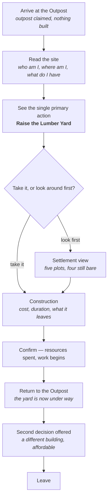
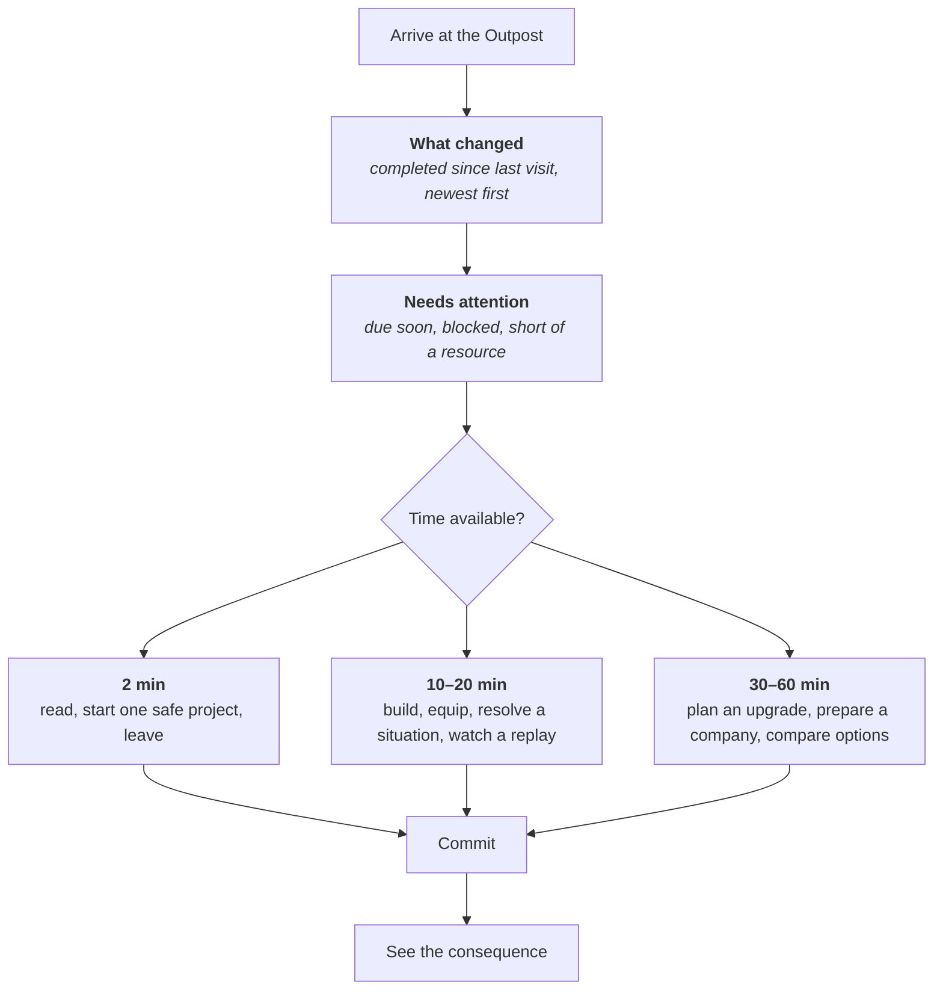
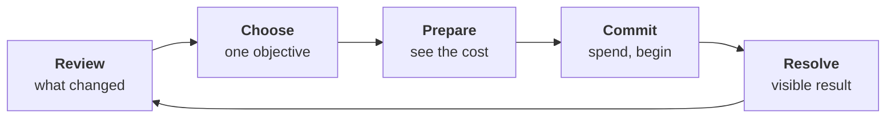

# Player journeys

**Status:** Proposed — awaiting design approval

Two journeys matter for Foundations of Iron: the **first session**, which has to
make the game legible, and the **returning session**, which is the one the
player will have hundreds of times.

---

## 1. First session

**Goal: the player understands they lead one settlement, developing one settlement,
and they make one real decision before they leave.**

Not: build everything. Not: see every system. One decision, understood.



### What each step must achieve

| Step | The player must come away knowing |
|---|---|
| Arrive | This is **my** settlement, and it has a place |
| Read the site | I hold six resources; I have one settlement; it is an outpost |
| Primary action | There is one obvious thing to do next |
| Construction | What it costs, how long it takes, what I have left afterwards — **before** confirming |
| Confirm | Something changed because I chose it |
| Return | The settlement is visibly different from two minutes ago |
| Second decision | There is more to do, and I have to choose — I cannot afford everything |

### The first useful action

**Raise the Lumber Yard.** One filled button on the Outpost; everything else
on the screen is quieter.

**This is a starter-balance hypothesis, not canon.** The Lumber Yard is the
cheapest building and timber appears in every other building's cost, so it is
the move least likely to strand a new player. Nothing in `project_sources/`
says Arkazia is short of timber — `arkazia.md` in fact lists **alpine forests**
alongside its iron-rich slopes. The proposal rests on the numbers in
`Content/BuildingCatalogue.cs`, and the Prompt 8 playtest can overturn it.

Proposed opening order — **also a hypothesis**:

```
Lumber Yard  →  Storehouse  →  Command Hall  →  ( Quarry | Mine )
```

Every building is individually affordable at the opening position; **all five
together are not**. That gap is what makes the first session a decision rather
than a checklist, and it is the property worth protecting if the numbers change.

### What the first session must not do

- **No tutorial overlay, no coach marks, no forced sequence.** If the first
  action needs a spotlight to be found, the screen is wrong.
- **No modal on arrival.** The player reads the settlement, not a dialog.
- **No forge, no army, no battle.** They are not reachable yet and must not be
  advertised as locked — an empty barracks the player cannot build toward is a
  worse first impression than no barracks at all.
- **No runes as a system.** One line of flavour at most; see §4.

---

## 2. Returning session

**Goal: answer three questions before the player has to ask them** — Workbase §5.

1. What completed while I was away?
2. What needs attention?
3. What can advance my settlement today?



### Session shapes

The player never picks a "mode" — the screen simply supports all three.

| Time | Path | Design consequence |
|---|---|---|
| **2 minutes** | Read the change list, start one queued thing, leave | The change list is above the fold and the primary action is one tap from arrival |
| **10–20 minutes** | One build plus one other system — later a craft, a company, a report | Cross-navigation from the Outpost to any area is one step |
| **30–60 minutes** | Compare, plan, sequence several commitments | Costs and durations are visible without opening each thing in turn |

**Elapsed time resolves on arrival, not on a timer.** A player away for three
days sees three days of completions in one list — that is the domain's timestamp
model (`ARCHITECTURE.md` §5.1) surfacing as a product property: nothing was lost
by not watching.

### Absence is not punished

- Nothing decays. Nothing expires unclaimed.
- A long absence produces a **longer change list**, aggregated — not a wall of
  individual ticks.
- The permanent settlement is never destroyed while the player is away
  (Workbase §6). The interface never implies otherwise.

---

## 3. The loop being taught

Both journeys teach one shape, which every later system extends:



Foundations of Iron fills it with construction. Prompt 6 adds forging, Prompt 7
adds battle. **The loop does not change shape when they arrive** — which is the
point of establishing it now, on the simplest possible content.

---

## 4. Foreshadowing runes

Runes are the long-term centre of the game and are **not a visible system** in
this slice.

**Permitted:** a single line of flavour in the settlement description — a rumour,
a weathered inscription in the ridge stone, an old story about the mountain.
Static text, nothing more.

**Forbidden:** rune inventory, probabilities, a Runeforging control, Aura, a
locked panel, a greyed-out tab, a progress bar toward runes, or any placeholder
that looks interactive. **A disabled control is an advertisement**, and Workbase
§17 is explicit that foreshadowing must create aspiration without giving the
tutorial a Fire sword.

If a reader of this package cannot tell whether something counts as
foreshadowing or exposure, it is exposure. Leave it out.
