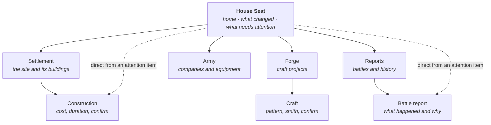

# Information architecture and navigation

**Status:** Proposed — awaiting design approval

---

## 1. The shape

**The House Seat is home.** Not the map, not the War Council. The player leads a
House that develops a settlement, and the home screen is that settlement's
report — Workbase §5.



**Four destinations, three detail views.** Construction, Craft and Battle report
are reached from their parent — and also **directly from a House Seat attention
item**, because the two-minute session must not require navigating a hierarchy
to act on the thing the screen just told the player about.

### What exists when

| Area | Prompt | Until then |
|---|---|---|
| House Seat, Settlement, Construction | 5–6 | — |
| Forge, Craft | 6 | Not present. **Not shown as locked** |
| Army | 7 | Not present |
| Reports, Battle report | 7 | Not present |

**Absent, not disabled.** A greyed-out tab teases a system the player cannot
reach and cannot work toward. Navigation shows what exists; it grows as the game
does.

---

## 2. Desktop

`≥ 48rem`. Content column maxes at `content-max` (72rem) and centres.

```
┌──────────────────────────────────────────────────────────────┐
│  ⌂ House Karrow · Ashen Reach              [Outpost]         │  header, surface-1
│  Gold 250   Prov 200   Timber 220   Stone 180   Ore 120  ⋯   │  resource bar
├────────────┬─────────────────────────────────────────────────┤
│            │                                                 │
│  Seat      │                                                 │
│  Settle…   │            screen content                       │  surface-0
│  Forge     │                                                 │
│  Army      │                                                 │
│  Reports   │                                                 │
│            │                                                 │
└────────────┴─────────────────────────────────────────────────┘
   sidebar                    max 72rem, centred
   surface-1
```

- **Persistent left sidebar.** Current area marked by `accent` fill **and** a
  left rule **and** `aria-current="page"` — never colour alone.
- **The resource bar is always visible.** Every commitment spends resources; the
  player must never navigate away to check whether they can afford something.
- **The header names the House and settlement.** Identity, on every screen.

---

## 3. Mobile

`< 48rem`. Single column, bottom tab bar.

```
┌────────────────────────┐
│ ⌂ Ashen Reach  [Outpost]│  header, compact
│ 250 200 220 180 120 ⌄  │  resource bar, tap to expand
├────────────────────────┤
│                        │
│                        │
│    screen content      │  single column
│                        │
│                        │
│                        │
├────────────────────────┤
│  ⌂    ⌂⌂    ⚒    ⚔   ▤ │  bottom tabs, 44px min
│ Seat  Settl Forge Army Rep│
└────────────────────────┘
```

- **Bottom tab bar**, thumb-reachable, `44 × 44px` minimum per target, icon
  **and** label always — never icon alone.
- **The resource bar collapses to values**, expanding on tap to show names.
  It never disappears.
- Tabs appear only for areas that exist; with three areas there are three tabs.

### The mobile rule

> **Any control that commits resources, confirms a craft or chooses a
> destination must be reachable in at most two taps from its screen, with no
> nested modal.**

This is the testable form of "mobile preserves all essential decisions". A
confirmation may be a sheet, but a sheet may not open another sheet. If a flow
cannot meet this, the flow is wrong, not the rule.

**No decision is desktop-only.** Wider viewports may show more at once —
side-by-side comparison, a longer history — but never a choice the phone cannot
make.

---

## 4. Navigation rules

- **Every screen is addressable by URL.** Back and forward behave. Refresh
  returns to the same place.
- **Back never loses committed work.** Commitment happens at confirm; leaving a
  form before then discards nothing that was spent.
- **Breadcrumbs on detail views only** — `Settlement › Storehouse`. Top-level
  areas need none.
- **One level of nesting.** Area → detail. Anything demanding a third level is a
  sign the model is wrong, and gets raised rather than absorbed.
- **Attention items are links.** Every item in "needs attention" navigates
  straight to where it is resolved.

---

## 5. Layout of the House Seat

The home screen's regions, in priority order. This ordering is the same on both
viewports — mobile stacks it, desktop may place *What changed* and *Needs
attention* side by side.

| Region | Answers | Priority |
|---|---|---|
| Identity — House, settlement, stage | Who am I | Always visible |
| Resources | What do I hold | Always visible |
| **Primary action** | What should I do now | First session: exactly one. Otherwise: see below |
| What changed | What completed while I was away | Above the fold |
| Needs attention | What is due, blocked or short | Above the fold |
| Settlement summary | What does my site look like | Below the fold |

**On the primary action.** Exactly one filled button is a **first-session**
device — the whole job of that screen is making the first move unmissable.

It does not generalise:

- a **returning** session may lead with a different action — collect a completed
  building, respond to what changed;
- some states have **none**, and must not manufacture one. An error offers a
  retry, not a next move. A state where everything is under way and nothing is
  affordable should say so plainly rather than fill the slot.

`COMPONENTS-AND-STATES.md` §4 records which states carry a primary action and
which deliberately do not.
